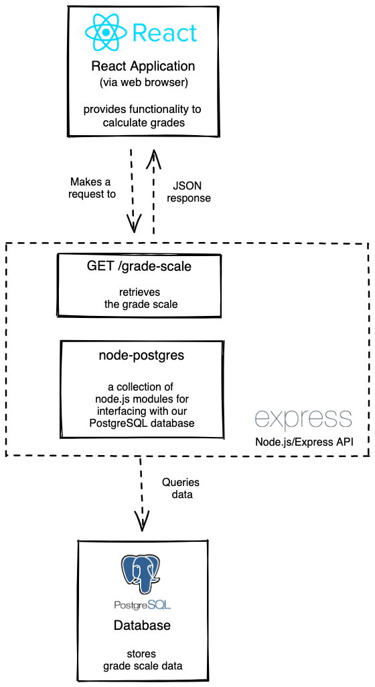
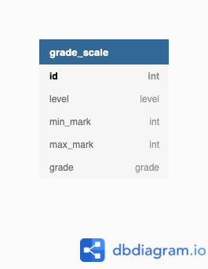

[](https://classroom.github.com/online_ide?assignment_repo_id=8178480&assignment_repo_type=AssignmentRepo)
# 03 Project - Grade Calculator

**Contents:**

- [03 Project - Grade Calculator](#03-project---grade-calculator)

## Scenario

You are working for a new startup, Grade Calculator. Its grading system allows tertiary education institutions to calculate the grades of Level 5 and Level 6 students.

---

## Architecture Diagrams



## Entity-Relationship Diagram



---

## Getting Started

**To build and run the app:**

```zsh
docker-compose up --build
```

**To run the client-side unit tests:**

```zsh
cd client
npm install
npm test
```

---

## Instructions

### Part A - Grade Calculator

<details>
  <summary>Instructions</summary>

Implement the [`getLetterGrade` utility function](./client/src/utils.js).

**User story**

- As a tertiary education institution administrator
- I want to calculate the students’ grades
- So that I can complete the students’ transcripts.

**Acceptance criteria**

- The `getLetterGrade` utility function uses the supplied `gradeScale`, `mark` and `level` to determine the correct letter grade.
- The `getLetterGrade` utility function does not return any hardcoded values.
- Validation is implemented for all arguments of the `getLetterGrade` utility function.
- GIVEN the grade calculator form is completed correctly, WHEN the user submits the form, THEN the correct grade is provided to the user.
- GIVEN the grade calculator form is completed incorrectly, WHEN the user submits the form, THEN a useful error message is displayed to the user.
